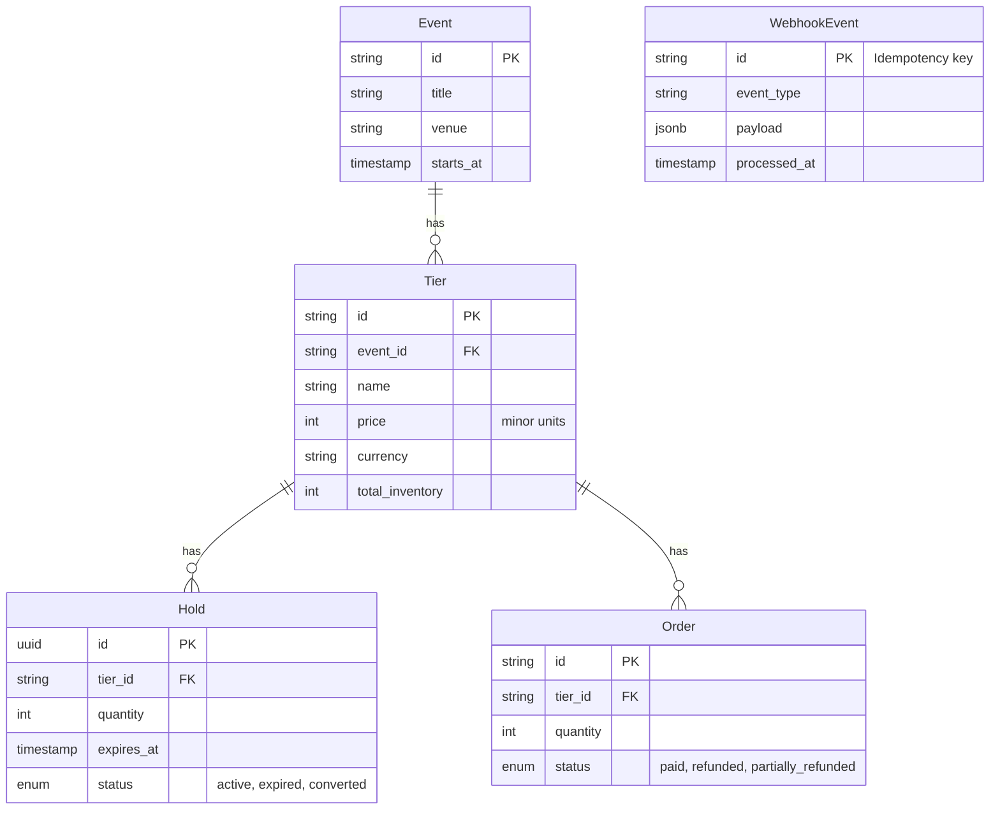

# Encore Tickets Inventory API

This is the backend API for Encore Tickets real-time ticket inventory system. It handles event querying, hold reservations with safe concurrency, and idempotency for payment webhooks.

## Tech Stack
- **Framework**: Next.js Route Handlers (App Router)
- **Database**: PostgreSQL — Docker locally, [Neon](https://neon.tech) in production
- **ORM**: TypeORM
- **Language**: TypeScript (Strict)
- **Deployment**: Vercel
- **Docs**: OpenAPI 3.0 / Swagger UI at `/docs`

## Schema Diagram



## How to Run Locally

### Prerequisites
- Node.js (v18+)
- Docker and Docker Compose

### Setup

1. **Start the database:**
   ```bash
   sudo docker compose up -d
   ```

2. **Install dependencies:**
   ```bash
   npm install
   ```

3. **Start the development server:**
   ```bash
   npm run dev
   ```
   The API will be available at `http://localhost:3000`. Next.js handles DB synchronization automatically in dev mode via TypeORM.

4. **Seed the database:**
   Open your browser or run curl to hit the seed endpoint:
   ```bash
   curl http://localhost:3000/api/seed
   ```

## Trade-offs and Design Decisions

1. **Hold Concurrency and Inventory Calculation**
   - **Decision**: Inventory is derived dynamically (`total - sum(active_holds) - sum(paid_orders)`) rather than maintained as a cached column on the `Tier` table.
   - **Trade-off**: Querying requires a small aggregation instead of a direct read. However, it prevents complex cache-invalidation bugs.
   - **Concurrency Control**: When creating a hold, we use a pessimistic write lock (`SELECT ... FOR UPDATE`) on the `Tier` row. This serializes concurrent hold attempts for the same tier, guaranteeing no overselling.

2. **Hold Expiration Mechanism**
   - **Decision**: Holds expire organically based on the `expires_at` timestamp. Our inventory query explicitly filters for `expires_at > NOW()`. We do not rely on a cron job to eagerly clean them up.
   - **Trade-off**: This avoids running a background job, which is complex in serverless environments. However, stale rows remain in the DB and will require a periodic cleanup script to purge old data and reclaim space eventually.

3. **Webhook Idempotency and Out-of-Order Delivery**
   - **Decision**: Webhook events are tracked in a `webhook_events` table using the `event_id` as the primary key. We wrap the webhook handling in a transaction and lock the target `Order` row.
   - **Out-of-Order**: If a refund arrives before a payment, we record the order as `refunded`. When the `paid` webhook finally arrives, it sees the `refunded` status and avoids overriding it, simply updating the hold statuses to clear the holds.

## Future Improvements (With Another Day)
- **Serverless Edge Support**: I would migrate from TypeORM to Drizzle ORM or Kysely. TypeORM is robust but heavy and not ideal for Next.js serverless functions / edge runtimes due to connection pooling issues.
- **Pg_Bouncer**: Add a connection pooler to prevent DB connection exhaustion under heavy load.
- **Unit & Integration Tests**: Implement `jest` or `vitest` to aggressively test the race conditions using concurrent `Promise.all` requests against a test database.
- **Background Worker for Purging**: Add an AWS SQS queue or a simple `pg_cron` extension to delete holds that have been expired for more than 7 days to keep the `holds` table lean.
